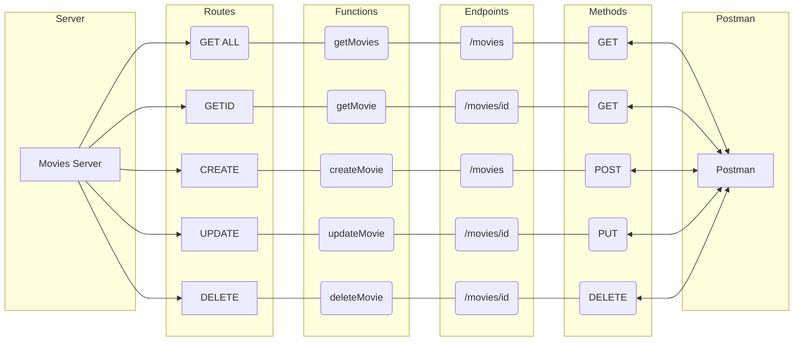

```mermaid
flowchart LR
    subgraph Server
        SERVER[Movies Server]
    end

    subgraph Routes

        GETALL(GET ALL)
        GETID
        CREATE
        UPDATE
        DELETE
    end
    subgraph Functions
        GETALLMOVIESFUNC(getMovies)
        GETIDMOVIESFUNC(getMovie)
        CREATEMOVIESFUNC(createMovie)
        UPDATEMOVIESFUNC(updateMovie)
        DELETEMOVIESFUNC(deleteMovie)
    end
    subgraph Endpoints
        GETALLMOVIESENDPOINT(/movies)
        GETIDMOVIESENDPOINT(/movies/id)
        CREATEMOVIESENDPOINT(/movies)
        UPDATEMOVIESENDPOINT(/movies/id)
        DELETEMOVIESENDPOINT(/movies/id)
    end
    subgraph Methods
        GETALLMOVIESMETHOD(GET)
        GETIDMOVIESMETHOD(GET)
        CREATEMOVIESMETHOD(POST)
        UPDATEMOVIESMETHOD(PUT)
        DELETEMOVIESMETHOD(DELETE)
    end

    subgraph Postman
        POSTMAN[Postman]
    end

    SERVER --> GETALL & GETID & CREATE & UPDATE & DELETE

    GETALL --- GETALLMOVIESFUNC --- GETALLMOVIESENDPOINT --- GETALLMOVIESMETHOD <--> POSTMAN
    GETID --- GETIDMOVIESFUNC --- GETIDMOVIESENDPOINT --- GETIDMOVIESMETHOD <--> POSTMAN
    CREATE --- CREATEMOVIESFUNC --- CREATEMOVIESENDPOINT --- CREATEMOVIESMETHOD <--> POSTMAN
    UPDATE --- UPDATEMOVIESFUNC --- UPDATEMOVIESENDPOINT --- UPDATEMOVIESMETHOD <--> POSTMAN
    DELETE --- DELETEMOVIESFUNC --- DELETEMOVIESENDPOINT --- DELETEMOVIESMETHOD <--> POSTMAN
```